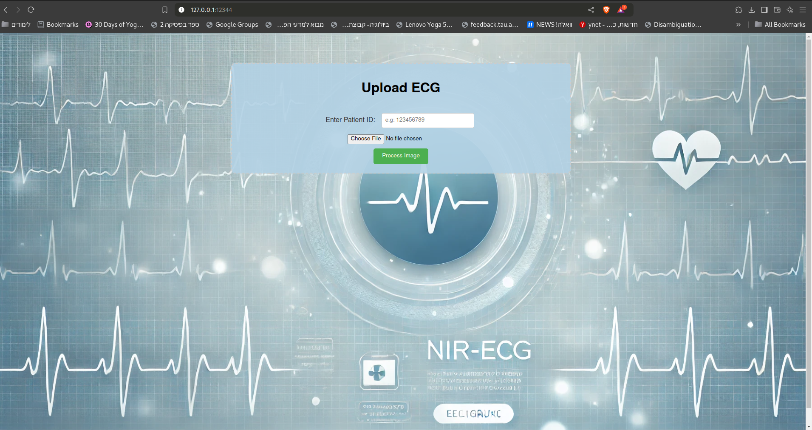

# 🫀 AI-Powered ECG Classification System

[](https://www.docker.com/)
[](https://www.python.org/)
[](https://pytorch.org/)
[](https://flask.palletsprojects.com/)
[](https://www.mongodb.com/)

A comprehensive end-to-end system for automated ECG classification using deep learning. This project combines state-of-the-art CNN architecture with a user-friendly web interface and robust data storage solution.

## 👁️ Interface Preview

### Main Interface
<div align="center">
  
  <br><br>
  
</div>

## 📋 Upload Guidelines

### ✅ Correct ECG Format
<div align="center">
  
  <p><i>Upload ECG images in this format for accurate classification</i></p>
</div>

### ❌ Incorrect ECG Format
<div align="center">
  
  <p><i>Do not upload ECG images in this format</i></p>
</div>

## 🎯 Features

- **Advanced ECG Classification**: Accurately categorizes ECGs into four classes:
  - Myocardial Infarction (MI)
  - Abnormal Heartbeat
  - History of MI
  - Normal ECG
- **Web Interface**: Simple and intuitive Flask-based web application
- **Automated Storage**: Seamless MongoDB integration for storing patient IDs and diagnoses
- **Docker Support**: Easy deployment with Docker Compose
- **Production-Ready**: Fully containerized application stack

## 🏗️ Project Structure

```
.
├── assets/                           # Images for documentation
│   ├── interface1.png
│   ├── interface2.png
│   ├── correct_ecg.png
│   └── incorrect_ecg.png
├── backend/
│   ├── model_training/
│   │   ├── data_processing.ipynb      # Data preprocessing pipeline
│   │   └── ecg_model_train.ipynb      # Model training notebook
│   └── ecg_classifier.pth             # Trained PyTorch model
├── web_api/
│   ├── static/
│   │   └── home_bg.png                # Web interface background
│   ├── templates/
│   │   └── home.html                  # Main web interface template
│   ├── app.py                         # Flask application
│   ├── model.py                       # Model inference code
│   ├── mongo.py                       # MongoDB integration
│   └── transformer.py                 # Data transformation utilities
├── docker-compose.yaml                # Docker composition file
├── mongo-init.js                      # MongoDB initialization script
├── requirements.txt                   # Python dependencies
└── .env                              # Environment variables (to be created)
```

## 🚀 Quick Start

1. Clone the repository:
```bash
git clone [repository-url]
cd [repository-name]
```

2. Create a `.env` file in the root directory with the following variables:
```env
# MongoDB Environment Variables
DB_NAME=                        # Your database name
COLLECTION_NAME=                # Your collection name
MONGO_INITDB_ROOT_USERNAME=     # MongoDB root username
MONGO_INITDB_ROOT_PASSWORD=     # MongoDB root password
MONGO_PORT=                     # MongoDB port (e.g., 27017)

# Flask Environment Variables
FLASK_PORT=                     # Flask application port (e.g., 5000)
```

3. Start the application:
```bash
docker compose up
```

4. Access the web interface at `http://localhost:[FLASK_PORT]`

## 💻 Usage

1. Navigate to the web interface
2. Enter the patient ID
3. Upload an ECG image
4. Click submit
5. Receive instant classification results
6. (Automatic) Results are stored in MongoDB

## 🛠️ Technical Stack

- **Backend**: Python, Flask
- **Deep Learning**: PyTorch, CNN
- **Database**: MongoDB
- **Containerization**: Docker, Docker Compose
- **Data Processing**: Jupyter Notebooks

## 📋 Components

### Backend
- **Model Training Pipeline**: Jupyter notebooks for data processing and model training
- **Trained Model**: Pre-trained PyTorch CNN model for ECG classification

### Web API
- **Flask Application**: Handles HTTP requests and serves the web interface
- **Model Integration**: Real-time inference using the trained model
- **MongoDB Connection**: Secure database operations for storing results
- **Web Interface**: Clean, user-friendly interface for ECG upload and analysis

## 🔒 Security Note

Ensure your `.env` file is properly configured and never commit it to version control. The file contains sensitive database credentials that should be kept secure.

## 🤝 Contributing

Contributions are welcome! Please feel free to submit a Pull Request.

## 📝 License

MIT License

Copyright (c) 2024 Nir

Permission is hereby granted, free of charge, to any person obtaining a copy
of this software and associated documentation files (the "Software"), to deal
in the Software without restriction, including without limitation the rights
to use, copy, modify, merge, publish, distribute, sublicense, and/or sell
copies of the Software, and to permit persons to whom the Software is
furnished to do so, subject to the following conditions:

The above copyright notice and this permission notice shall be included in all
copies or substantial portions of the Software.

THE SOFTWARE IS PROVIDED "AS IS", WITHOUT WARRANTY OF ANY KIND, EXPRESS OR
IMPLIED, INCLUDING BUT NOT LIMITED TO THE WARRANTIES OF MERCHANTABILITY,
FITNESS FOR A PARTICULAR PURPOSE AND NONINFRINGEMENT. IN NO EVENT SHALL THE
AUTHORS OR COPYRIGHT HOLDERS BE LIABLE FOR ANY CLAIM, DAMAGES OR OTHER
LIABILITY, WHETHER IN AN ACTION OF CONTRACT, TORT OR OTHERWISE, ARISING FROM,
OUT OF OR IN CONNECTION WITH THE SOFTWARE OR THE USE OR OTHER DEALINGS IN THE
SOFTWARE.

---

Made with ❤️ by Nir